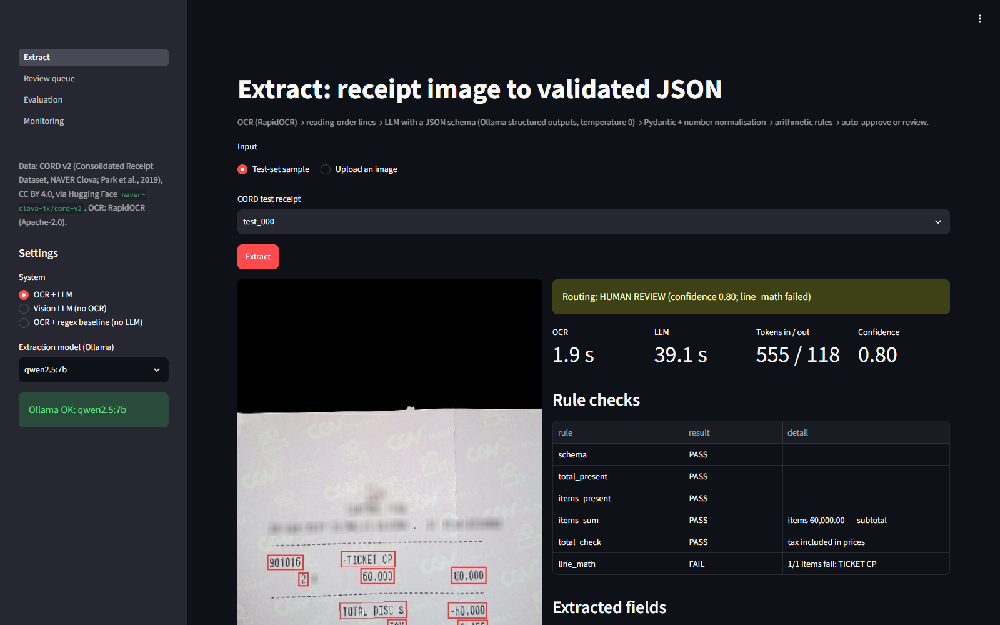

# Document AI: receipts to validated JSON

> **Status (2026-09-30): complete.** All evaluations ran on the CORD v2 test split. The prompt (v1)
> was frozen before dev scoring, and the approve threshold was chosen on dev only. The vision LLM ran
> on a 30-receipt subset only.




App pages: [Extract](results/screenshots/extract.png) | [Review queue](results/screenshots/review.png) | [Evaluation](results/screenshots/evaluation.png) | [Monitoring](results/screenshots/monitoring.png). Runs fully locally with Ollama; no paid APIs.

## Problem
Turn photos of shop and restaurant receipts into structured JSON (items, subtotal, tax, service,
total) that downstream systems can trust. An LLM can read a receipt, but it can also misread or
invent a number. So every extraction is checked by arithmetic business rules, and only receipts that
reconcile are auto-approved; the rest go to a human review queue. Quality is measured field by field
on a public labelled dataset.

## Architecture
```
 receipt image
      |
      v
 RapidOCR (PP-OCR, ONNX, CPU, 4 threads) ---- text boxes + positions
      |
      v
 line reconstruction (deskew by median box angle, group by vertical overlap, sort by x)
      |
      v                                          (d) OCR-free alternative:
 LLM via Ollama, structured outputs              image --> vision LLM --> same JSON schema
 (JSON schema in `format`, temperature 0;
  receipt text wrapped as data, not instructions)
      |
      v
 Pydantic Receipt + number normalisation (thousands dots/commas, decimal commas, "Rp", "@", brackets)
      |
      v
 business rules (tolerance 1 unit or 0.5%):
   items sum = subtotal | subtotal - discount + tax + service = total | qty x unit = line total
   (+ tax-inclusive variants common on Indonesian receipts)
      |
      v
 confidence (rule fails / unverifiable checks / missing fields)
      |
      +--> all rules pass  --> AUTO-APPROVE
      +--> otherwise       --> REVIEW QUEUE (SQLite; edit, re-check, approve in the app)

 every app request -> SQLite trace (stage timings, model, tokens, input, output, rules)
```

Code: `src/ocr.py`, `src/extract.py` (prompt + Ollama call), `src/schema.py` (Pydantic + CORD
mapping), `src/normalize.py`, `src/validation.py` (rules, confidence, routing), `src/baseline.py`
(regex system), `src/evaluation.py` (metrics), `src/tracing.py` (traces + review queue),
`streamlit_app.py`.

## Dataset and licence
**CORD v2** (Consolidated Receipt Dataset for post-OCR parsing), NAVER Clova AI: Park et al.,
*CORD: A Consolidated Receipt Dataset for Post-OCR Parsing*, Document Intelligence Workshop at
NeurIPS 2019. Hugging Face `naver-clova-ix/cord-v2`, pinned revision `7f0115a4`.
**Licence: CC BY 4.0** (from the dataset card). Images are Indonesian shop/restaurant receipts.

| Split used | CORD split | Receipts | Role |
|---|---|---|---|
| dev | validation | 100 | all tuning (prompt, regex rules, rule tolerances, threshold) |
| test | test | 100 | reported numbers, scored once |

CORD's train split (800) is not used: no system here is trained.

**Label mapping** (CORD `gt_parse` -> our schema; code in `src/schema.py`):

| CORD key | Schema field |
|---|---|
| `menu[].nm` | `items[].name` |
| `menu[].cnt` | `items[].quantity` |
| `menu[].unitprice` | `items[].unit_price` |
| `menu[].price` | `items[].line_total` (if `menu[].itemsubtotal` exists it is the line total and `price` the unit price) |
| `menu[].sub` | not separate items: modifiers/add-ons belong to their parent item |
| `sub_total.subtotal_price` | `subtotal` |
| `sub_total.discount_price` | `discount` (positive magnitude; used by the rules, not scored) |
| `sub_total.tax_price` | `tax` |
| `sub_total.service_price` | `service_charge` |
| `total.total_price` | `total` |
| (no label in CORD v2) | `store_name`, `currency`: extracted but **not scored** |

Label coverage on test: total 95, subtotal 65, tax 41, service 12 of 100 receipts; 251 items.

## Windows setup and run
```powershell
cd AI_Engineer_Portfolio\doc_ai_receipts
& "C:\Program Files\Python313\python.exe" -m venv .venv
.venv\Scripts\python -m pip install -r requirements.txt
ollama pull qwen2.5:7b ; ollama pull qwen2.5:3b ; ollama pull qwen2.5vl:3b   # vision model optional

.venv\Scripts\python scripts\prepare_data.py              # download CORD, write images + gold
.venv\Scripts\python scripts\run_ocr.py --split dev       # then --split test (resumable)
.venv\Scripts\python scripts\eval_extract.py --split test --system regex
.venv\Scripts\python scripts\eval_extract.py --split test --system ocr_llm --model qwen2.5:7b
.venv\Scripts\python scripts\eval_extract.py --split test --system ocr_llm --model qwen2.5:3b
.venv\Scripts\python scripts\eval_extract.py --split test --system vision --model qwen2.5vl:3b --limit 30
.venv\Scripts\python scripts\score.py --split test
.venv\Scripts\python scripts\error_analysis.py --split test
.venv\Scripts\python -m pytest -q
.venv\Scripts\streamlit run streamlit_app.py
```
Evaluation runs cache one JSONL row per receipt in `results/preds/` and resume after interruption.

## Results (test split)
These come from `results/metrics_test.csv`, written by `scripts/score.py --split test --threshold 1.0`.
The scorer was re-run on 2026-09-30 and wrote a byte-identical file. Prompt v1, temperature 0,
approve threshold 1.0.

**Quality** (100 CORD test receipts; vision on the first 30 only):

| System | Total acc | Subtotal | Tax | Service | Item P / R / F1 | Item count | Exact match | Auto-approve | Exact among approved | Errors sent to review |
|---|---|---|---|---|---|---|---|---|---|---|
| (a) OCR + regex | 0.80 | **0.84** | **0.91** | 0.95 | 0.69 / 0.75 / 0.716 | 0.50 | 0.31 | 0.42 | **0.69** | **81%** |
| **(b) OCR + qwen2.5:7b** (main) | **0.88** | 0.81 | 0.85 | **0.99** | 0.75 / 0.80 / **0.772** | **0.78** | **0.39** | **0.53** | 0.66 | 70% |
| (c) OCR + qwen2.5:3b | 0.81 | 0.61 | 0.73 | 0.85 | 0.68 / 0.69 / 0.682 | 0.80 | 0.20 | 0.43 | 0.37 | 66% |
| (d) vision qwen2.5vl:3b (n=30) | 0.73 | 0.63 | 0.77 | 0.97 | 0.61 / 0.69 / 0.649 | 0.83 | 0.13 | 0.30 | 0.33 | 77% |
| Upper bound: gold OCR + qwen2.5:7b | 0.95 | 0.83 | 0.89 | 0.99 | 0.82 / 0.87 / 0.843 | 0.85 | 0.46 | 0.68 | 0.63 | 54% |
| Ceiling: gold labels through the rules | - | - | - | - | - | - | - | 0.86 | 1.00 | - |

"Errors sent to review" is the share of receipts that are not an exact match and were routed to
review rather than auto-approved.

**Same 30 receipts for every system** (`results/metrics_test_subset.csv`; this is the fair
comparison for vision):

| System (n=30) | Total | Subtotal | Tax | Item F1 | Exact match | Auto-approve |
|---|---|---|---|---|---|---|
| (a) regex | 0.80 | 0.80 | 0.90 | 0.714 | 0.37 | 0.57 |
| (b) OCR + 7B | 0.90 | 0.80 | 0.90 | 0.658 | 0.33 | 0.50 |
| (c) OCR + 3B | 0.87 | 0.60 | 0.73 | 0.662 | 0.13 | 0.40 |
| (d) vision 3B | 0.73 | 0.63 | 0.77 | 0.649 | 0.13 | 0.30 |
| gold OCR + 7B | 1.00 | 0.90 | 0.97 | 0.779 | 0.43 | 0.63 |

**Latency and throughput** (CPU only, i5-1235U, 4 OCR threads; seconds per receipt):

| System | OCR p50 / p95 | LLM p50 / p95 | Receipts per minute | Prompt / output tokens (mean) |
|---|---|---|---|---|
| (a) regex | 1.9 / 3.0 | 0 | 30.1 | - |
| (b) OCR + 7B | 1.9 / 3.0 | 32.0 / 90.1 | 1.4 | 539 / 189 |
| (c) OCR + 3B | 1.9 / 3.0 | 16.5 / 43.2 | 2.7 | 539 / 194 |
| (d) vision 3B | - | 127.6 / 145.3 | 0.5 | 1508 / 197 |
| gold OCR + 7B | - | 38.1 / 96.5 | 1.3 | 532 / 188 |

**What it means**
- **The 7B is the best overall system, but not on every field.** It wins on total (0.88 vs 0.80),
  item F1, item count, whole-receipt exact match and auto-approve rate. The keyword regex is still
  better on subtotal and tax. Its exact-match rate among approved receipts (0.69) is also slightly
  above the 7B's (0.66), because it approves fewer receipts. With 100 receipts, differences of a
  few points are within noise.
- **The routing works, but it is not a guarantee.** For the 7B, 96% of auto-approved receipts have
  the right total, against 79% of those sent to review. Still, a third of approved receipts are not a
  perfect match. The rules check arithmetic, so a consistent but incomplete receipt (e.g. a missed
  zero-priced item) can pass.
- **OCR costs about 7 points of total accuracy.** With CORD's own word annotations as perfect OCR,
  the same 7B and prompt reach 0.95 total and 0.843 item F1, up from 0.88 and 0.772.
- **The 3B is half the latency but clearly worse.** It misses subtotals (0.61), and only 37% of its
  approved receipts are exact. One 3B output was truncated and one failed the schema.
- **The vision 3B is the slowest and weakest here.** On the 30-receipt subset it scores 0.73 total
  and 0.13 exact, at about 2 minutes per receipt on CPU. It is a CPU result on a small subset, not a
  verdict on vision models.
- **The routing ceiling is 86%.** The gold labels themselves pass every rule on only 86% of test
  receipts (90% of dev). A perfect extractor could not be auto-approved more often; the remaining
  receipts have printed numbers that do not reconcile (unlabelled discounts, missing lines, rounding).

### Approve threshold (chosen on dev only)
`results/routing_curve_dev.csv`, OCR + 7B on the 100 dev receipts:

| Threshold | Approve rate | Exact among approved | Total acc among approved |
|---|---|---|---|
| **1.0 (kept)** | 0.56 | 0.714 | 0.982 |
| 0.8 | 0.62 | 0.710 | 0.984 |
| 0.6 | 0.77 | 0.571 | 0.935 |
| 0.5 | 0.91 | 0.495 | 0.923 |

**Decision: keep 1.0.** That auto-approves only receipts where every rule passed and nothing was
unverifiable. Lowering it to 0.8 approves receipts with an unverifiable check (e.g. no subtotal
printed). On dev that adds 6 approvals, 4 of them exact. It is not a clear gain: 2 more wrong
receipts would be auto-approved, and the evidence is 6 receipts. Below 0.8, precision falls sharply.
The test curve (`results/routing_curve_test.csv`) was not used for this choice. Test was re-scored
at 1.0, which gives the numbers above.

## Error analysis
Source: `scripts/error_analysis.py --split test` on the main system (OCR + 7B), giving
`results/error_analysis_test.json` and `results/errors_test.csv`. Each wrong scalar field and each
unmatched item is assigned automatically. If the gold amount does not appear in the OCR text, it is
an **OCR** error. If it appears but the model missed it, chose another number or invented one, it is
an **extraction** error. If the model copied the right string but parsing changed it, it is a
**normalisation** error.

**Scalar fields (47 wrong fields):**

| Bucket | Count | Fields |
|---|---|---|
| OCR: gold amount not in the OCR text | 10 | total 5, subtotal 2, tax 2, service 1 |
| Extraction: present but the model returned null | 29 | subtotal 15, tax 13, total 1 |
| Extraction: present but the model chose another number | 2 | total 2 |
| Extraction: value where the gold has none | 6 | total 4, subtotal 2 |
| Normalisation: right string, wrong parse | **0** | - |

**Items:** 18 gold items missed because the OCR lost or garbled them, 15 missed although readable,
18 found with the wrong line total, and 39 extra predicted items.

**OCR errors** (10 scalars, 18 items):
- `test_014`: the OCR read the total `281,435` as `TOTAL 28435` (a digit and the comma were lost).
  The model copied what it saw.
- `test_013`: the amounts column was not recognised at all. Subtotal, tax, total and both items are
  missing from the OCR text, and the model returned an empty receipt.
- `test_030`: `Subtotal` came out as `Su101al`, and the total `31,500` line was lost (`Dne al 350`).
  The model returned all nulls, although the item, subtotal and tax amounts were readable.

**Extraction errors** (37 scalars; the biggest bucket):
- **Skipped subtotal/tax is the main failure (28 of 29 "missed").** `test_048`: the OCR text has
  `PB1: 2,272`, `Subtotal: 22,728` and `Total: 25,000` on clean lines. The model returned the item and
  the total but null subtotal and tax. Many are tax-inclusive receipts where subtotal + tax =
  total is printed after the item lines. Prompt v1 seems to treat them as optional.
- **Wrong number** (2): `test_068`: the OCR merged two labels into one line, `CASH TOTAL .50,000`, and
  the model took the cash amount as the total (gold 20,000). `test_089`: the OCR read the total as
  `48:888` (gold 40,000), and the model copied it. Inspected by hand, both are really OCR/layout
  errors that the automatic rule counts as extraction, because the gold digits appear elsewhere on the
  receipt.
- **"Spurious"** (6) are mostly **label gaps, not model errors.** `test_037` prints a total of 20.000,
  but CORD labels it `total_etc`, not `total_price`. `test_057` and `test_076` label only the cash
  paid. The model's answer is arguably right in these cases.
- **Item line totals** (18): `test_004` `AVOCADD COFFEE   21   61,000`: a stray OCR token `21` was
  read as a quantity, and the model multiplied it, giving 1,281,000 (gold 61,000). `test_023` printed
  `6 TWIST DONUT`, and the model returned 6 x 54,000, but the gold line total is 54,000.
- **Extra items** (39): modifiers or sub-lines listed as items (`test_008` `NATA DE COCO = 0`, which
  is a topping in CORD), `1X @11000` quantity lines split into their own item (`test_003`), and
  header lines (`test_005` `ITEMS`).

**Normalisation errors: none on test (and none on dev).** Asking the model for money values as
printed strings and parsing them in code (`src/normalize.py`, unit-tested) removed this class of
error. Dev shows the same pattern: 35 missed, 7 OCR, 3 wrong value, 1 spurious, 0 normalisation.

## Design decisions
- **CORD validation = dev, CORD test = test**, as the build spec says; no random re-split.
- **Money values are strings in the LLM schema.** The model copies "60.000" as printed and our
  normaliser parses it. Indonesian receipts use '.' as the thousands separator; asking the LLM for
  numbers invites it to read "60.000" as 60.
- **Number rule:** a separator followed by exactly three digits is a thousands separator; a final
  separator with one or two digits is a decimal point. Tested in `tests/test_normalize.py`.
- **Modifiers (`menu.sub`) are not items.** In CORD they are toppings/options, mostly priced 0.
- **Tax-inclusive receipts.** Many Indonesian receipts print PB1 tax that is already inside the
  prices. The rules accept `subtotal + service = total` when a tax is printed, and
  `items = subtotal + tax` when the subtotal is printed net. Found on dev gold, where the naive
  rules failed on correct labels.
- **Confidence** starts at 1 and subtracts per failed rule (items sum / total check 0.4, line math
  0.2), missing total (0.5), no items (0.3), and unverifiable checks (0.15 / 0.05). Any failed rule
  routes to review regardless of the threshold.
- **Exact match** requires all four scored scalars and the full item list (matched by name similarity
  >= 0.6 and equal line total, no extras). It is strict on purpose: it is the "no human needed" bar.
- **OCR threads fixed at 4** (`config.yaml`) so OCR latency is comparable between runs, and batch
  jobs only run while holding the shared `..\.llm_lock` (the RAG project shares the CPU).
- **Regex baseline** rules were tuned on dev only (e.g. "SUBTTL", "20 000", "Total Tax Included").
- **No mock fallback:** if Ollama is down, the app shows the error. The regex system is offered as an
  explicit, labelled alternative, not a silent fallback.
- **Prompt v1 is frozen; no dev tuning was done.** The evaluation chain ran unattended (2026-09-30),
  and the prompt was frozen before any dev scoring, so no prompt change was made without review. Dev
  was scored only to choose the approve threshold. One candidate fix had already been seen in a dev
  smoke test: the model returned null where the receipt prints `PB1: 0`, which should be tax = 0. It
  was **not** applied and is listed under next steps. Any prompt v2 must be tuned on dev and then
  scored once on test.
- **Approve threshold 1.0, chosen on dev only** (see "Approve threshold" above). Test was scored once
  at that threshold.
- **Vision on a subset:** `qwen2.5vl:3b` takes about 2 minutes per receipt on this CPU, so it ran on
  the first 30 test receipts (fixed by id order, not chosen by result). Every other system is also
  reported on the same 30.
- **App deep link** `/?sample=test_000&run=1` runs one Extract and reuses the result. It was added so
  the headless screenshot check needs only one Ollama request.

## Limitations
- **CORD is one country's receipts** (Indonesian rupiah, mostly no decimals). Other number formats
  are handled by the normaliser but not measured.
- **Store name and currency are not scored,** because CORD v2 has no labels for them. The model
  sometimes invents a currency: on `test_000` the 7B returned "USD" for a rupiah receipt.
- **The test set is small.** With 100 test receipts (30 for vision), differences of a few points
  between systems are within noise.
- **The rules check arithmetic, not truth.** A receipt that misses a zero-priced item, or misreads two
  numbers consistently, can still be auto-approved. About a third of the 7B's approved receipts are
  not a perfect match (they usually still have the right total: 96%).
- **Some gold labels are incomplete.** Several "spurious" errors are totals that CORD labels as
  `total_etc` or leaves out. The scores slightly understate the systems on those receipts.
- **The automatic error buckets are heuristic.** They test whether the gold digits appear anywhere in
  the OCR text, so some OCR/layout errors are counted as extraction errors (e.g. `test_068`,
  `test_089`).
- **CPU only:** LLM latency here does not represent a GPU deployment. The vision result is a CPU,
  30-receipt result.

## Next steps
- **Prompt v2, tuned on dev only:**
  - tell the model to always extract the subtotal and tax lines when they are printed (the biggest
    error bucket, with 28 of 47 wrong scalars);
  - the tax=0 rule ("a printed 0 is 0, not null");
  - "do not list modifiers/toppings or `1X @price` lines as items";
  - "currency only if printed".
  Then score test once with the new version.
- **A repair pass:** when a rule fails, re-prompt the model with the failing check.
- **Few-shot examples** chosen from dev.
- **Better OCR line grouping** for merged label lines like `CASH TOTAL`.
- **Run the vision model on all 100 test receipts** on the GPU laptop.

## Runs on an 8 GB laptop
Measured on 2026-09-30 on the build laptop (`results/memory.json`):

| Component | Memory |
|---|---|
| Streamlit app (server process, all 4 pages rendered + one Extract) | 169 MB RSS (492 MB private) |
| RapidOCR engine, if an image is uploaded (separate-process measurement) | +~111 MB |
| Ollama `qwen2.5:7b` Q4_K_M, num_ctx 4096 (`/api/ps`) | 4.71 GiB |
| Ollama `qwen2.5:3b` / `qwen2.5vl:3b` | not measured (not loaded during this check) |

The app plus OCR stays around 300 MB. The model dominates. On the 8 GB demo laptop:
- **Run only this app,** with no Docker stack and no other AI project at the same time.
- **The 7B fits** (about 5 GB with the app) if little else is open, and on the GPU laptop Ollama
  offloads it to VRAM.
- **If memory is tight,** set `llm.model: qwen2.5:3b` in `config.yaml` or pick it in the sidebar.
  It roughly halves latency, but test quality is clearly lower (exact match 0.20 vs 0.39).
- **The Evaluation, Review and Monitoring pages read result files only.** They need no model, so
  they work even with Ollama stopped.
